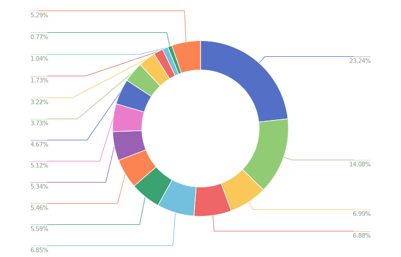
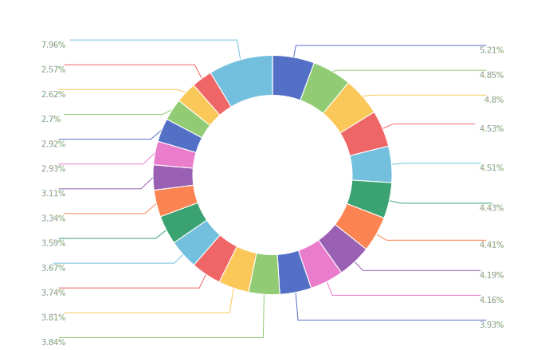

<p align="center">
  
</p>

# 青庚：中文医疗对话语言模型

  

> 有鸟焉，其状如鹊，青身白喙，白目白尾，名曰青耕，可以御疫，其鸣自叫。				——《山海经》

青耕，有御疫之意。庚，五行属金，金曰从革。革新以御疫，是为青庚。


## 项目简介

本项目开源了基于ChatGLM-6B LoRA 16-bit指令微调的中文医疗通用模型。基于共计28科室的**中文医疗共识与临床指南文本**，我们生成**医疗知识覆盖面更全，回答内容更加精准**的高质量指令数据集。以此提高模型在医疗领域的知识与对话能力。


## 快速开始

1. 配置项目依赖环境

   ```bash
   cd src
   pip install -r requirements.txt
   ```

2. [下载](https://cloud.tsinghua.edu.cn/d/fb9f16d6dc8f482596c2/)ChatGLM-6B模型参数`pytorch_model-0000X-of-00008.bin`（参考[ChatGLM-6B](https://github.com/THUDM/ChatGLM-6B)），将其放入`./model`目录下。

3. 运行交互文件（要求单卡显存 >= 15G）

   ```bash
   CUDA_VISIBLE_DEVICES=$cuda_id python ./demo.py
   ```

4. 命令行交互界面实例

   ```tex
   Human:
   医生您好，我现在在用一长三速胰岛素注射治疗糖尿病，晚上长效胰岛素注射 12 个单位，速效胰岛素在三餐前注射各6 个单位，血糖不是特别稳，早上空腹的血糖高，晚餐后有时候血糖低，我该如何调整？
   ------------------------------------------------
   Answer:
   非常感谢您向我咨询关于胰岛素注射的问题。根据您提供的信息，您正在使用一长三速胰岛素注射治疗糖尿病，并且晚上需要注射12 个单位。速效胰岛素在三餐前注各6 个单位，但是血糖不是特别稳，早上空腹的血糖高，晚餐后有时候血糖低。针对您的问题，我建议采取以下措施：
   1. 调整饮食：饮食对于控制血糖非常重要。您可以尝试控制饮食中的糖分和碳水化合物的摄入量，以降低空腹血糖和餐后血糖的波动。同时，建议增加蛋白质和脂肪的摄入量，以满足身体的能量需求。
   2. 监测血糖：建议定期监测血糖，了解血糖的变化情况。可以随身携带血糖仪，并在需要时进行监测。
   3. 调整胰岛素剂量：根据您的血糖水平和饮食控制情况，调整长效和速效胰岛素的剂量。可以咨询您的医生或专业营养师，以确定最佳的剂量和剂量组合。
   4. 增加运动：适量的运动可以帮助控制血糖。建议每周进行至少 150 分钟的有氧运动，如快走、慢跑、骑车等。
   5. 保持良好的睡眠和心理状态：充足的睡眠和心理状态对于血糖的控制也非常重要。建议保持规律的睡眠时间，避免过度疲劳和压力。
   请注意，以上建议仅供参考，具体的治疗方案需要根据您的具体情况进行调整。同时，建议咨询专业的医生或营养师，以获得更加个性化的建议和指导。
   ```

   

## 数据集构建

本项目数据主要分为两个部分：情景对话与知识问答

| 数据类型 |            描述            |   数量   | 占比（%） |
| :------: | :------------------------: | :------: | :-------: |
| 情景对话 | 在具体场景下的医患诊疗对话 |   52k    |   28.57   |
| 知识问答 |  医学知识问题的解释性回答  |   130k   |   71.43   |
| **总计** |           **-**            | **182k** |  **100**  |

### 情景对话

主要参考[BELLE](https://github.com/LianjiaTech/BELLE)的指令数据集生成方式，我们将医学指令按照诊疗情景的不同主要分为16种大类，通过100条情景对话种子任务生成的52k条情景对话数据。 情景对话种子任务详见`./data/dialogue_seed_task.json`。此外，我们还提供了生成情景对话数据的pipeline`./data/dialogue_generation.py`。最终生成的52k情景对话数据医学指令类型及其分布如下图所示。

<p align="center">
  
</p>

### 知识问答

医学知识来源于我们自建的医学数据库。通过提供具体的医疗共识与临床指南文本，先让ChatGPT生成与该段医学知识内容与逻辑关系相关的若干问题，再通过“文本段-问题”对的方式让ChatGPT回答问题，从而使ChatGPT能够生成含有医学指南信息的回答，保证回答的准确性。知识问答与医疗指南的例子详见`./data/book_data.json`，依据医疗指南生成的知识问答样例详见`./data/book_based_qa.json`。此外，我们还提供了知识问答数据生成的pipeline`./data/book_based_question_generation.py`。

<p align="center">
  
</p>

其中，医疗共识与临床指南中文本段涵盖28个科室共计32k个文本段。各科室及其分布如下

<p align="center">
  
</p>


## 模型输出样例
更多我们模型的测试结果详见`./data/test_result.json`
<!DOCTYPE html>
<html>
<head>
</head>
<body>
<table>
  <tr>
      <td><strong>问题</strong></td>
      <td><strong>ChatGLM</strong></td>
      <td><strong>QingGeng</strong></td>
  </tr>
  <tr>
    <td style="width: 20%;">冠心丹参滴丸在哪些方面优于对照组？有哪些不良反应和服药禁忌？</td>
    <td style="width: 40%;">冠心丹参滴丸是一种中药制剂，主要用于治疗冠心病、心绞痛等心血管疾病。以下是冠心丹参滴丸可能优于对照组的一些方面：<br />1.疗效明显：冠心丹参滴丸具有活血化瘀的功效，可以扩张血管、增加心脏负担、改善心肌缺血等，对治疗冠心病、心绞痛等心血管疾病具有显著疗效。2.安全性好：冠心丹参滴丸是一种中药制剂，不良反应相对较少，且疗效稳定，不易出现反弹。 3.费用相对较低：冠心丹参滴丸是一种口服用药，相对于其他治疗方法，费用相对较低。<br />需要注意的是，冠心丹参滴丸是一种药物，使用时需要遵循医生的建议，严格按照剂量和使用方法服用，避免出现不良反应。同时，冠心丹参滴丸也有一些禁忌，例如孕妇、哺乳期妇女、儿童、老年人、患有其他疾病的人等不宜使用。在使用前最好咨询医生，以确保用药安全。</td>
    <td style="width: 40%;">冠心丹参滴丸是一种中药制剂，主要成分包括丹参、山楂、银杏叶等。其优势包括：1. 改善心脏功能：冠心丹参滴丸能够增加心肌收缩力和心肌氧供，改善心脏功能，降低心脏病风险。2. 降低血脂和血压：冠心丹参滴丸能够降低血脂和血压，预防心血管疾病的发生和发展。3. 改善血液循环：冠心丹参滴丸能够增加血管的弹性和扩张度，改善血液循环，预防血栓形成和血管阻塞。<br /><br />不良反应包括：1. 胃肠道不适：如恶心、呕吐、腹泻等。2. 过敏反应：如皮疹、荨麻疹、瘙痒等。3. 肝损伤：如肝功能异常、肝昏迷等。<br /><br />服药禁忌包括：1. 孕妇、哺乳期妇女和儿童禁用。2. 患有高血压、糖尿病、心脏病、肝病、肾病等慢性疾病的患者禁用。3. 患有出血性疾病、肝功能不全、心律失常等患者禁用。4. 对冠心丹参滴丸过敏的患者禁用。5. 正在服用其他药物的患者应在医生指导下使用。6. 服用前应仔细阅读说明书，并按照医生的建议服用。</td>
  </tr>
  <tr>
    <td>临床应用中，哪些经验方治疗效果好，对患者的康复有帮助？</td>
    <td>很遗憾，作为一个人工智能模型，我没有足够的信息来回答这个问题。经验方是指在临床应用中经过长期观察和验证，被认为对某些疾病或症状有良好的治疗效果的方剂。然而，在临床实践中，经验方的治疗效果受到很多因素的影响，如方剂的组成、剂量、用法、适应症、禁忌症等，而且不同的疾病和患者个体也需要不同的治疗方案。因此，对于经验方的选择和使用，应该在医生的指导下进行，由经验丰富的医生根据患者的具体情况制定治疗方案，并经过严格的临床验证和评估。此外，需要注意的是，经验方并不是万能的，在一些疾病或情况下，可能需要采用现代医学的诊断和治疗方法。因此，在临床应用中，应该根据疾病的特点、患者的情况以及现代医学的进展，综合考虑选择最佳的治疗方案。</td>
    <td>经验方是指由临床经验积累而成的、针对特定疾病或症状的个体化治疗方案。在临床应用中，一些经验方治疗效果好，对患者的康复有帮助，包括：<br/> 1. 针灸疗法：针灸疗法是一种中医疗法，通过刺激人体的穴位来调节人体的气血、阴阳平衡，从而缓解症状，促进康复。 2. 中药疗法：中药疗法包括中药煎剂、口服中药、针灸、按摩等，中药疗法具有疗效好、副作用小、易于操作等特点，在临床应用中被广泛采用。 3. 物理治疗：物理治疗包括按摩、推拿、理疗等，可以缓解疼痛、改善肌肉紧张、促进关节活动等，对康复有很好的帮助。 4. 运动疗法：运动疗法包括物理治疗、康复运动、舞蹈等，可以增强身体柔韧性、协调性、平衡性等，对康复有很好的帮助。5. 心理疗法：心理疗法包括心理治疗、认知行为疗法等，可以帮助患者缓解焦虑、抑郁等负面情绪，提高自信心和自尊心，对康复有很好的帮助。<br/> 需要注意的是，经验方治疗效果因人而异，需要根据患者的具体情况进行个体化治疗，同时需要医生和患者共同制定治疗方案，以达到最佳的治疗效果。</td>
  </tr>
  <tr>
    <td>...</td>
    <td>...</td>
    <td>...</td>
  </tr>
</table>
</body>
</html>


## 模型训练

本项目训练代码采用模型并行算法，可以在最少4张3090显卡上完成对ChatGLM LoRA 16-bit的指令微调。训练命令如下

```bash
cd src
CUDA_VISIBLE_DEIVCES=$cuda_id python train.py \
                        --title $YOUR_EXP_NAME \
                        --train_path $YOUR_TRAINING_DATA_PATH \
                        --save_dir $YOUR_LORA_CHECKPOINT_SAVE_PATH
```


## 贡献

本项目由上海交通大学未来媒体网络协同创新中心和上海人工智能实验室智慧医疗中心合作研发。模型数据系统主要由刘泓呈，孟昱同，廖育生完成，指导教师为[王钰](https://mediabrain.sjtu.edu.cn/yuwang/)副教授。


## 免责声明

预训练模型是基于大量语料库和算法模型进行训练的，并且在训练过程中可能存在偏差、错误和不完整的信息。因此，本项目提供的预训练模型仅供参考和研究使用，并不能保证其准确性和可靠性。使用预训练模型产生的结果可能存在误差和偏差，不能用于实际应用或决策。本项目不对使用预训练模型所产生的结果承担任何责任，也不对因使用预训练模型所产生的任何损失承担责任。使用者在使用预训练模型时应自行承担风险并进行自我验证。


## 引用

如果你使用了本项目的数据或者代码，请声明引用

```latex
@misc{MedicalGPT-zh,
  author={Hongcheng Liu, Yusheng Liao, Yutong Meng, Yu Wang, Yanfeng Wang},
  title = {青庚：中文医疗对话语言模型},
  year = {2023},
  publisher = {GitHub},
  journal = {GitHub repository},
  howpublished = {\url{https://github.com/MediaBrain-SJTU/MedicalGPT-zh}},
}
```

